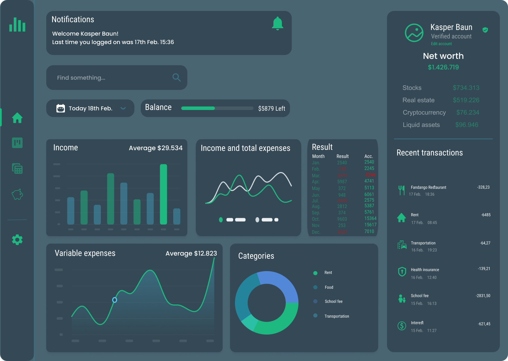

<!-- PROJECT SHIELDS -->
<!--
*** I'm using markdown "reference style" links for readability.
*** Reference links are enclosed in brackets [ ] instead of parentheses ( ).
*** See the bottom of this document for the declaration of the reference variables
*** for contributors-url, forks-url, etc. This is an optional, concise syntax you may use.
*** https://www.markdownguide.org/basic-syntax/#reference-style-links
-->


<!-- PROJECT LOGO -->
<br />
<div align="center">
  <a href="https://github.com/KasperBaun/BoostMyEconomy">
    
  </a>

<h3 align="center">BoostMyEconomy</h3>

  <p align="center">
    Personal Finance Tool or Workspace to analyze spending in detail - boost your economy today!
    <br />
    <br />
    <a href="https://github.com/KasperBaun/BoostMyEconomy">View Demo</a>
    ·
    <a href="https://github.com/KasperBaun/BoostMyEconomy/issues">Report Bug</a>
    ·
    <a href="https://github.com/KasperBaun/BoostMyEconomy/issues">Request Feature</a>
    
  [![Contributors][contributors-shield]][contributors-url]
  [![Forks][forks-shield]][forks-url]
  [![Stargazers][stars-shield]][stars-url]
  [![Issues][issues-shield]][issues-url]
  </p>
</div>


<!-- TABLE OF CONTENTS -->
<details>
  <summary>Table of Contents</summary>
  <ol>
    <li>
      <a href="#about-the-project">About The Project</a>
      <ul>
        <li><a href="#built-with">Built With</a></li>
      </ul>
    </li>
<!--    <li>
      <a href="#getting-started">Getting Started</a>
      <ul>
        <li><a href="#prerequisites">Prerequisites</a></li>
        <li><a href="#installation">Installation</a></li>
      </ul>
    </li>
    <li><a href="#usage">Usage</a></li> -->
    <li><a href="#roadmap">Roadmap</a></li>
    <li><a href="#contributing">Contributing</a></li>
    <li><a href="#contact">Contact</a></li>
    <!--<li><a href="#acknowledgments">Acknowledgments</a></li>-->
  </ol>
</details>


<!-- ABOUT THE PROJECT -->
## About The Project

The purpose of this project is to create an application that can provide the user with a detailed overview of private expenses and income.
The overview is visualized by graphic data in the application's dashboard.
The visualization includes pie charts, graphs, tables, lists and headings, all of which help to inform the user about the type and amount of consumption divided into categories such as:
<ul>
  <li>Food</li>
  <li>Personal care</li>
  <li>Rent, water, electricity and heating</li>
  <li>Entertainment</li>
  <li>Transport</li>
  <li>TV and internet</li>
  <li>Insurances</li>
  <li>Repayment of loans (mortgage, consumer loans, etc.)</li>
  <li>Quality of life</li>
  </ul>
  
  The application will also list various calculations such as:
  </br>
  <ul>
    <li>Average daily consumption</li>
    <li>Sum of consumption over the last 7 days</li>
    <li>Sum of consumption per. month</li>
    <li>Highlights (“You spent $ 500 less on fast food in January than you did in December!”) Such as nudging for more rational behavior</li>
  </ul>
  </br>
The idea is that the overview can be used for reflection and increase awareness of one's own financial behavior. With the possiblity to optimize one's own consumption pattern so that the opportunity is created for more economy for the things that the user feels gives real value.

<p align="right">(<a href="#top">back to top</a>)</p>


### Built With

* [Blazor](https://dotnet.microsoft.com/en-us/apps/aspnet/web-apps/blazor)
* [EntityFramework](https://docs.microsoft.com/en-us/ef/)
* [ASP.NET Web API](https://dotnet.microsoft.com/en-us/apps/aspnet/apis)
* [C#](https://docs.microsoft.com/en-us/dotnet/csharp/)
* [Figma](https://www.figma.com/)
</br>
The project consists of a Blazor Server application [Frontend](https://github.com/KasperBaun/BoostMyEconomy/) and a EntityFrameWork with ASP.NET Web API [Backend](https://github.com/KasperBaun/BMEAPI) (MySQL server).
<p align="right">(<a href="#top">back to top</a>)</p>


<!-- GETTING STARTED 
## Getting Started

The project consists of a Blazor Server application [Frontend](https://github.com/KasperBaun/BoostMyEconomy/) and a EntityFrameWork with ASP.NET Web API [Backend](https://github.com/KasperBaun/BMEAPI)
To get a local copy up and running follow these simple example steps.

### Prerequisites

This is an example of how to list things you need to use the software and how to install them.
* npm
  ```sh
  npm install npm@latest -g
  ```

### Installation

1. Get a free API Key at [https://example.com](https://example.com)
2. Clone the repo
   ```sh
   git clone https://github.com/KasperBaun/BoostMyEconomy.git
   ```
3. Install NPM packages
   ```sh
   npm install
   ```
4. Enter your API in `config.js`
   ```js
   const API_KEY = 'ENTER YOUR API';
   ```

<p align="right">(<a href="#top">back to top</a>)</p>
-->


<!-- USAGE EXAMPLES 
## Usage

Use this space to show useful examples of how a project can be used. Additional screenshots, code examples and demos work well in this space. You may also link to more resources.

_For more examples, please refer to the [Documentation](https://example.com)_

<p align="right">(<a href="#top">back to top</a>)</p>
-->


<!-- ROADMAP -->
## Roadmap

- [ ] Imagerecognition of receipts for adding costs in detail 
- [ ] Data import and export through .CSV files
- [ ] Hints for improvements and tips for gaining knowledge about personal economy
- [ ] Net worth calculations

<!--See the [open issues](https://github.com/KasperBaun/BoostMyEconomy/issues) for a full list of proposed features (and known issues). -->

<p align="right">(<a href="#top">back to top</a>)</p>


<!-- CONTRIBUTING -->
## Contributing

Contributions are what make the open source community such an amazing place to learn, inspire, and create. Any contributions you make are **greatly appreciated**.

If you have a suggestion that would make this better, please fork the repo and create a pull request. You can also simply open an issue with the tag "enhancement".
Don't forget to give the project a star! Thanks again!

1. Fork the Project
2. Create your Feature Branch (`git checkout -b feature/AmazingFeature`)
3. Commit your Changes (`git commit -m 'Add some AmazingFeature'`)
4. Push to the Branch (`git push origin feature/AmazingFeature`)
5. Open a Pull Request

<p align="right">(<a href="#top">back to top</a>)</p>


<!-- LICENSE
## License

Distributed under the MIT License. See `LICENSE.txt` for more information.

<p align="right">(<a href="#top">back to top</a>)</p>
-->


<!-- CONTACT -->
## Contact

Kasper Baun - [mailto:kasperbaun@hotmail.com](kasperbaun@hotmail.com)

Project Link: [https://github.com/KasperBaun/BoostMyEconomy](https://github.com/KasperBaun/BoostMyEconomy)

<p align="right">(<a href="#top">back to top</a>)</p>


<!-- ACKNOWLEDGMENTS
## Acknowledgments

* []()
* []()
* []()

<p align="right">(<a href="#top">back to top</a>)</p>
-->


<!-- MARKDOWN LINKS & IMAGES -->
<!-- https://www.markdownguide.org/basic-syntax/#reference-style-links -->
[contributors-shield]: https://img.shields.io/github/contributors/KasperBaun/BoostMyEconomy.svg?style=for-the-badge
[contributors-url]: https://github.com/KasperBaun/BoostMyEconomy/graphs/contributors
[forks-shield]: https://img.shields.io/github/forks/KasperBaun/BoostMyEconomy.svg?style=for-the-badge
[forks-url]: https://github.com/KasperBaun/BoostMyEconomy/network/members
[stars-shield]: https://img.shields.io/github/stars/KasperBaun/BoostMyEconomy.svg?style=for-the-badge
[stars-url]: https://github.com/KasperBaun/BoostMyEconomy/stargazers
[issues-shield]: https://img.shields.io/github/issues/KasperBaun/BoostMyEconomy.svg?style=for-the-badge
[issues-url]: https://github.com/KasperBaun/BoostMyEconomy/issues
[linkedin-shield]: https://img.shields.io/badge/-LinkedIn-black.svg?style=for-the-badge&logo=linkedin&colorB=555
[linkedin-url]: https://linkedin.com/in/Kasper-Baun
[product-screenshot]: images/screenshot.png
